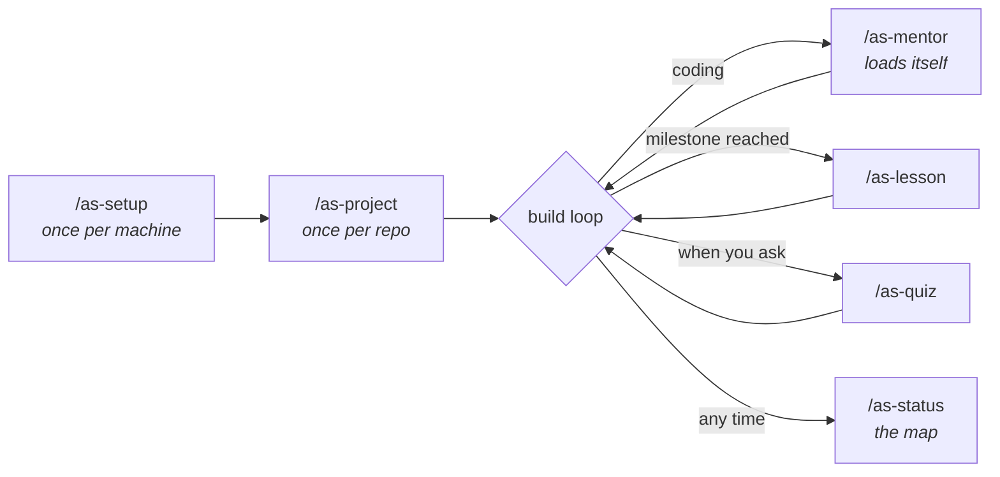

<div align="center">

# ai-scaffold

**The place where "I don't know" makes sense.**

*Eight agent skills for Claude Code that turn the agent into an adaptive mentor:
it teaches at your level — from first line of code to autonomous — while your real project ships.*



[](LICENSE)
[](#status)
[](https://github.com/Dupflo/decision-ledger)

</div>

---

People aren't afraid of jumping into coding with AI anymore. They're afraid of
understanding **nothing** about what just got built. What's missing isn't
courage, it's a harness: project-first learning, adapted to the level you
actually have — not the curriculum someone imagined for you.

You are not at school. School imposes the way you learn. Here, the learning
adapts to you.

**The reference user:** a UX designer who has never written a line of
JavaScript, knows the word "responsive", can't write CSS — and ships their
webapp *and* can explain how it works.

## How it feels

You tell it what you do for a living, how long you can honestly focus, and
whether you like the example or the idea first. Then you build. The agent
codes with you at the ratio your level calls for:

| Your level | What a coding turn looks like |
|---|---|
| **0 · discover** | The idea in 3–5 sentences, in *your* vocabulary → the code, commented where it matters → you say back why it's built this way, in one sentence |
| **1 · tinker** | The code, with one small marked gap that's yours to fill (`// your turn:`) |
| **2 · junior** | Normal code; every structural choice justified in one line as it's made |
| **3 · autonomous** | A normal agent. The scaffolding is down. |

Levels are **per technology, per project** — a junior in CSS can be a
level 0 in SQL, and one global number would erase exactly the signal that
matters. Bars rise as you ship. That's the whole game.

## The journey



Only `/as-mentor` loads on its own. Everything else is a command you run.

| Skill | When |
|---|---|
| `/as-setup` | Once per machine. Five questions, a profile, a dependency check. |
| `/as-profile` | Show or edit your profile. |
| `/as-project` | Once per repo. Your goal in your words, a proposed stack you didn't have to pick alone, honest per-tech levels, and a curriculum where **every milestone ships something you can see working**. |
| `/as-mentor` | Adapts every coding turn to your level. The heart. |
| `/as-lesson` | The lesson for the current milestone, sized to your focus budget, anchored in your own files. |
| `/as-quiz` | Retrieval practice on concepts you met days ago, asked about *your* code. Opt-in, never fired at you. |
| `/as-level` | Moves a tech's level — from evidence, one level at a time. |
| `/as-status` | Milestones, concepts, levels. A map, never a score. |

## Install

The native path, for Claude Code users:

```bash
/plugin marketplace add Dupflo/ai-scaffold
/plugin install ai-scaffold@dupflo-ai-scaffold
```

Or by script — global (`~/.claude/skills`) by default, because your learning
profile describes *you*, not a repo, and should follow you everywhere:

```bash
curl -fsSL https://raw.githubusercontent.com/Dupflo/ai-scaffold/main/install.sh | bash
```

```bash
./install.sh --project     # this repo only
./install.sh --uninstall   # removes the symlinks, keeps your profiles
```

Then run `/as-setup` once, and `/as-project` in the repo you dream about.

**Language:** the README, the code and the state files are English. The
conversation is not — every skill speaks the user's language from the first
question. A French designer gets French lessons; the files stay portable.

## The rules this thing lives by

**Never a gate.** Code is written in the same turn, at every level. "Just
build it" always works, and works the first time you say it. A mentor that
blocks your project gets uninstalled on day one, and rightly so.

**The illusion of competence is the enemy.** The AI does, you believe you
know — that's the real risk of AI-assisted building for a learner.
Reformulation, spaced retrieval and the decision ledger exist to close that
gap without ever slowing the build.

**Every milestone ships.** A learner funds their motivation with working
software, not completed chapters. If a curriculum step doesn't put something
on screen, it's cut differently.

**No learning-styles folklore.** You won't be asked whether you're a "visual
learner" — matching teaching to declared styles has no evidence behind it.
The profile asks what does: prior knowledge, example-first vs concept-first,
honest focus budget, and it leans on retrieval practice and scaffolding
(Bruner's word, and this plugin's namesake).

**A map, not a score.** No streaks, no percentages, no praise ceremonies.
The state describes the path and the project, never rates the person.

**"I don't know" is a valid answer.** It's the input this whole tool is named
after. It gets a three-line explanation anchored in your code, and the
concept comes back later — as a question you'll answer unaided, which is the
best signal there is.

## Companion tools

ai-scaffold stays small by handing off to independent packages instead of
absorbing them. Both are runtime-only dependencies: optional, checked when
needed, updated on their own schedule — and everything works without them.

<table>
<tr>
<td width="50%" align="center" valign="top">

<p align="left"><b><a href="https://github.com/Dupflo/decision-ledger">decision-ledger</a></b> owns structural decisions — data model, auth, state ownership, a dependency that will spread. ai-scaffold hands off to it and reads its map back into <code>/as-status</code>. Requires <code>&gt;= 0.2.0</code> (<code>ledger --version</code>); absent, it says so exactly once.</p>
</td>
<td width="50%" align="center" valign="top">

<p align="left"><b><a href="https://github.com/Dupflo/ainnotations">ainnotations</a></b> is visual feedback on the running app: draw, highlight and comment on the page itself; the notes land in <code>annotations.md</code> and the agent applies them. Offered once at <code>/as-project</code> (<code>npx ainnotations init</code>) — and offered <i>first</i> to users whose craft is visual: for a designer, drawing on the screen beats describing it in words, and the annotate → apply → check loop is the review cycle made tangible.</p>
</td>
</tr>
</table>

## State

```
~/.ai-scaffold/profile.md    you — local only, never committed
.scaffold/                   this project's learning path — commit it on a
  project.md                 solo project; think first on a shared one
  curriculum.md
  progress.md
```

Formats in [`references/state-files.md`](references/state-files.md).
Telemetry: **nothing is sent, ever, in this version.** `/as-setup` records
your yes/no for the day the feature exists, and offers a third option —
"what is telemetry?" — that explains before it asks again.

## Status

Early. Concept and skeleton, being dogfooded on the author's own projects
first — including this one, whose structural decisions sit in its own
[`.mastery/index.json`](https://github.com/Dupflo/decision-ledger#this-repos-own-ledger-for-real)-style
ledger. If nobody tolerates a mentor in their terminal, that finding gets
published here rather than quietly dropped.

## License

MIT.
